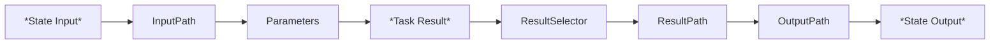

## ASL (Amazon States Language)

- State Machine Structure
- Intrinsic Functions
- Common State Fields

### State Machine Structure
- **Fields**
  - Comment (optional)
  - StartAt (required)
  - States (required)
  - TimeoutSeconds (optional)
  - Version (optional)

- **Execution Termination:**
  - "End"
  - Terminal States (Succeed, Fail, or End)

### Input and Output Processing
- `InputPath`
- Process JSON as input and output
  - ***Path*** - a string beginning with *$* (identify components in a JSON text)
    - the dollar sign($) is the path that contains the input, everything that we passing around in our state
  - Reference Paths: access fields using dot *"."* and *[ ]* notation

```json
// state input
{
  "name": "Pass",
  "output": {
    "lambdaResult": {
    "ExecutedVersion": "34",
      "Payload": {
        "statusCode": 200,
        "body": "Quote: Step Functions and Lambdas - even better!!"
      }
    }
  }
}
```

```json
{
  "Comment": "A description of my state machine",
  "StartAt": "input",
  "TimeoutSeconds": 12,
  "Version": "1.0",
  "States": {
    "input": {
      "Type": "Pass",
      "InputPath": "$.output", // Pulling in just the "output" field, which is going to be passed as input to the next state
      "Next": "Wait"
    },
    "Wait": {
      "Type": "Wait",
      "InputPath": "$.lambdaResult.Payload",
      "Seconds": 5,
      "End": true
    }
  }
}
```

### Parameters - Key-value Pairs
- `Parameters`
- Process JSON as input and output 
  - *Parameters* - used to create a collection, JSON object, key-value pair to be passed as an input

```json
{
  "Comment": "A description of my state machine",
  "StartAt": "input",
  "TimeoutSeconds": 12,
  "Version": "1.0",
  "States": {
    "input": {
      "Type": "Pass",
      "Parameters": {
        "About": "Pulling data that I want",
        "Info": {
          "status.$": "$.output.lambdaResult.Payload.statusCode",
          "body.$": "$.output.lambdaResult.Payload.body"
        }
      },
      "Next": "Wait"
    },
    "Wait": {
      "Type": "Wait",
      "InputPath": "$.Info",
      "Seconds": 5,
      "End": true
    }
  }
}
```

### Data flow simulator
- https://ap-northeast-2.console.aws.amazon.com/states/home?region=ap-northeast-2#/simulator
- State Input
  - InputPath
  - Parameters
- Task Result
  - ResultSelector
  - ResultPath
  - OutputPath
- State Output

